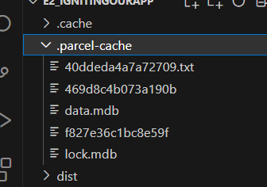

# Namaste React

## Parcel 
- Bundler
- creates a Local Server
- Does HMR- Hot Module Replacement
- For HMR uses File Watching Algorithm wriiten in C++
- Does Caching and hense provides Faster Builds
- .parcel-cache file created Observe them
- uses those  .parcel-cache Files if we del them and rebuild/ start it takes around 400ms (can take seconds as well) otherwise 1-30ms
- Image optimistaion
- Bundling
- Minificatioon of code
- Compressing
