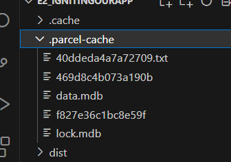

# Namaste React

## Parcel 
- Bundler
- creates a Local Server
- Does HMR- Hot Module Replacement
- For HMR uses File Watching Algorithm wriiten in C++
- Does Caching and hense provides Faster Builds
- .parcel-cache file created Observe them
- uses those  .parcel-cache Files if we del them and rebuild/ start it takes around 400ms (can take seconds as well) otherwise 1-30ms
- Image optimistaion
- Bundling
- Minificatioon of code
- Compressing

## JSX
- jsx is not HTML in JS
- Jsx is Html like syntax extension for JS.
- Jsx written in signle line does not require to be enclosed in () But to write it in Multiple  () is required as babel need to understand where it starts and ends 

## Babel
- Transpiles JSX codes into React under standable Code

## Namaste Food App

/*
#### Header
- Logo
- Nav items
#### Body
- Search Bar
- RestaurantContainer
  - RestaurantCard
     - img,name
     - rating,cuisine,delivery time

#### Footer
- Copyright
- Links
- Adress
- Contact
*/

